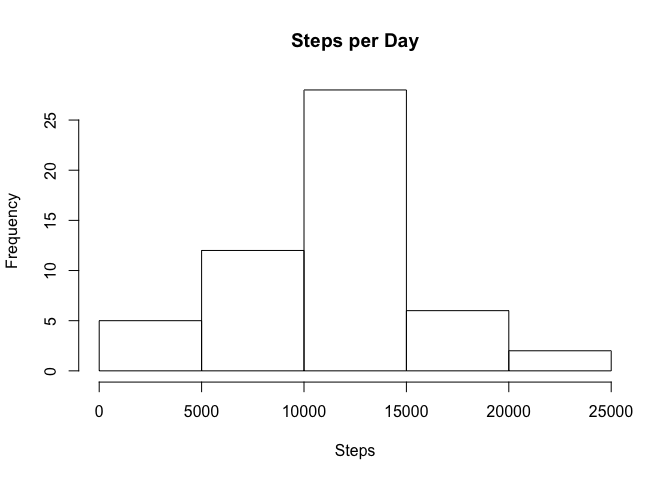
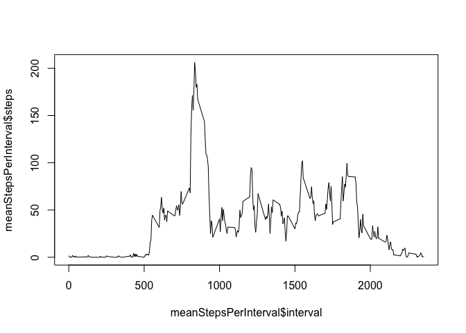
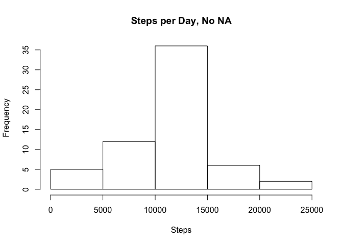
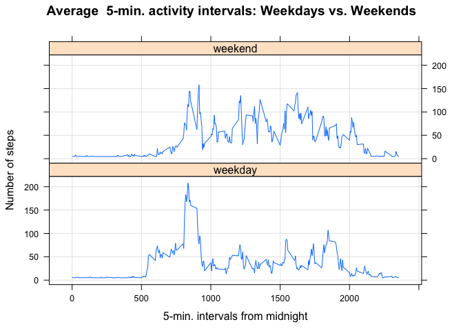

# Reproducible Research: Peer Assessment 1

## Loading and preprocessing the data

```r
setwd("~/github/RepData_PeerAssessment1")
dataSteps <- read.csv("activity.csv")
library(lattice)
```

## What is mean total number of steps taken per day?
####this builds the steps by day

```r
dataStepsDate <- tapply(dataSteps$steps, dataSteps$date, sum)
```

1.)  Make a histogram of the total number of steps taken each day

```r
hist(dataStepsDate, main="Steps per Day", xlab="Steps", ylab="Frequency")
```



2.)  Calculate and report the mean and median total number of steps taken per day

```r
mean(dataStepsDate, na.rm=TRUE)
```

```
## [1] 10766.19
```

```r
median(dataStepsDate, na.rm=TRUE)
```

```
## [1] 10765
```

## What is the average daily activity pattern?
Make a time series plot of the 5-minute interval

```r
meanStepsPerInterval <- aggregate(dataSteps$steps ~ dataSteps$interval, data=dataSteps, mean, na.rm=T)
names(meanStepsPerInterval)<-c("interval", "steps")
plot(meanStepsPerInterval$interval, meanStepsPerInterval$steps, type="l")
```



Which 5-minute interval contains the maximum number of steps

```r
maxMeanInterval <- meanStepsPerInterval$interval[which.max(meanStepsPerInterval$steps)]
maxMeanInterval
```

```
## [1] 835
```

## Imputing missing values
1.)  Calculate and report the total number of missing values

```r
missSteps <- sum(is.na(dataSteps$steps))
missSteps
```

```
## [1] 2304
```

```r
missDate <- sum(is.na(dataSteps$date))
missDate
```

```
## [1] 0
```

```r
missInterval <- sum(is.na(dataSteps$interval))
missInterval
```

```
## [1] 0
```

2.)  Devise a strategy for filling the NA values 
We will simply take the mean value over the entire dataset and use this to replace the NA values

3.)  Create a new dataset with missing values removed

```r
dataSteps_NoNA <- dataSteps
imputVar <- mean(dataSteps$steps[!is.na(dataSteps$steps)])
imputVar
```

```
## [1] 37.3826
```

```r
dataSteps_NoNA$steps[is.na(dataSteps_NoNA$steps)] <- imputVar
```

verify no NA

```r
sum(is.na(dataSteps_NoNA$steps))
```

```
## [1] 0
```

```r
sum(is.na(dataSteps$steps))
```

```
## [1] 2304
```

4.)  Create the histogram for the data:

```r
dataStepsDate_NoNA <- tapply(dataSteps_NoNA$steps, dataSteps_NoNA$date, sum)
hist(dataStepsDate_NoNA, main="Steps per Day, No NA", xlab="Steps", ylab="Frequency")
```



Does the new dataset differ?
The means are basically the same

```r
mean(dataStepsDate,na.rm=TRUE)
```

```
## [1] 10766.19
```

```r
mean(dataStepsDate_NoNA) 
```

```
## [1] 10766.19
```

The medians are basically the same

```r
median(dataStepsDate, na.rm=TRUE)
```

```
## [1] 10765
```

```r
median(dataStepsDate_NoNA)
```

```
## [1] 10766.19
```

What is the impact of missing data
sum of steps is 656k vs 570k, the total number of steps overall increases

```r
sum(dataStepsDate_NoNA)
```

```
## [1] 656737.5
```

```r
sum(dataStepsDate, na.rm=TRUE)
```

```
## [1] 570608
```

## Are there differences in activity patterns between weekdays and weekends?
1.)  Create new vector variable for weekday/weekendflag
This dataset is being created with a switch to classify weekend and weekday

```r
dataSteps_NoNA$weekday_flag <- sapply(weekdays(as.Date(dataSteps_NoNA$date)), switch, Sunday='weekend', Saturday='weekend', 'weekday')
```

This is just a check to verify a baseline result

```r
aggregate(dataSteps_NoNA$steps, list(dataSteps_NoNA$weekday_flag), mean)
```

```
##   Group.1        x
## 1 weekday 35.61058
## 2 weekend 42.36640
```

This is building the dataset used for the panel plot for weekend and weekday differences

```r
meanStepsPerIntervalDay <- aggregate(dataSteps_NoNA$steps ~ dataSteps_NoNA$interval+dataSteps_NoNA$weekday_flag, data=dataSteps_NoNA, mean)
```

name the columns for readability

```r
names(meanStepsPerIntervalDay) <- c("interval", "weekday_flag", "steps") 
```

Using plot to get around limitation of baseplot and numeric values only

```r
xyplot(steps ~ interval | weekday_flag, data=meanStepsPerIntervalDay, type="l", grid=T, layout=c(1,2), ylab="Number of steps", xlab="5-min. intervals from midnight", main="Average  5-min. activity intervals: Weekdays vs. Weekends")
```


